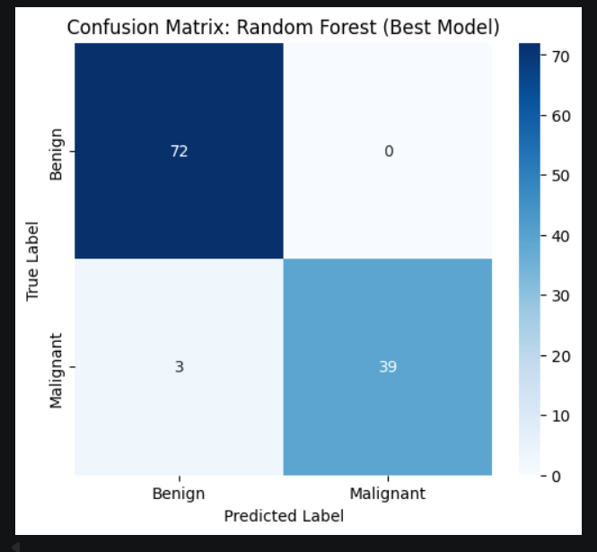
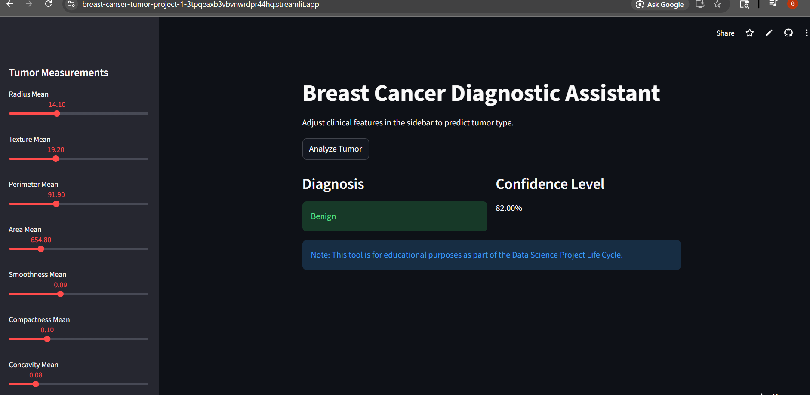

# BREAST-CANSER-TUMOR-PROJECT-1
# Breast Cancer Classification Project

**Student Name:** GAYATHRI PS, APARNA.V

**Course:** Msc computer science with specilaized in Data Analytics
1. Problem Statement

The goal is to predict whether a breast tumor is Benign or Malignant using clinical measurements of cell nuclei. By utilizing machine learning algorithms, we aim to provide a data-driven diagnostic tool that assists medical professionals in identifying breast cancer at an early stage, potentially improving patient survival rates.
## 2. Dataset Description

* **Source:** Wisconsin Breast Cancer Dataset (Kaggle).

* **Size:** 569 rows and 32 columns.

* **Target:** diagnosis (M = Malignant, B = Benign).
* ## 3. Methodology Overview

I followed the 10-stage lifecycle:

* **Cleaning:** Handled unnecessary columns (dropped id and Unnamed: 32) and encoded the target variable (M=1, B=0).
* **EDA:** Visualized feature distributions and correlation heatmaps to identify the strongest predictors of malignancy.

* **Models:** Developed and compared three primary classifiers: Logistic Regression, Support Vector Machine (SVM), and Random Forest.

* **Best Model:** **RANDOM FOREST** with ~97% accuracy.
* **Preprocessing:** Applied StandardScaler to normalize clinical features for better model convergence.
* ## 4. Results & Comparison

| Model | Accuracy | Recall |

| :--- | :--- | :--- |

| **Random forest** | **97.37%** | **95.65%** |

| Logistic Regression | 95.62% | 91.38% |

| SVM| 96.49% | 93.48%|

## 5. Model Interpretation

The Confusion Matrix below shows our SVM model's performance on the test set:

### Deployment Screenshots

#### Benign Prediction

#### Malignant Prediction

6. Live Deployment
[View Live Streamlit App Here](https://breast-canser-tumor-project-1-3tpqeaxb3vbvnwrdpr44hq.streamlit.app/)
